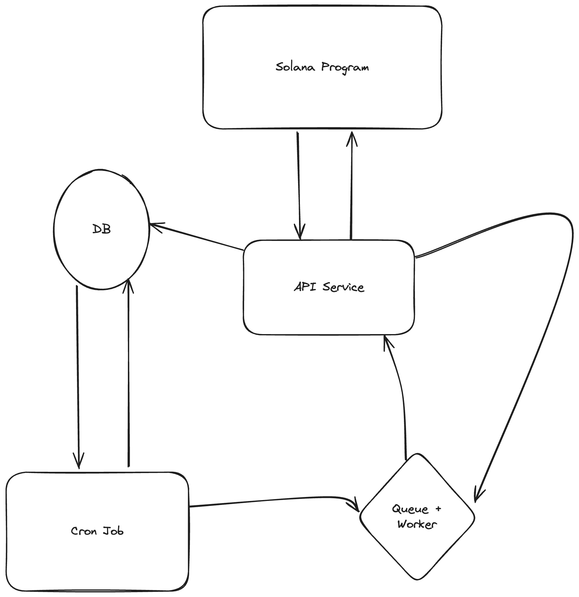

# solfundme

> This is a project done as part of Encode's Solana Bootcamp!

`solfundme` is a solana application that allows one to raise funds for a goal, similar to GoFundMe.

Core functions:

1. Creator can create a campaign.
2. Contributor can contribute to an existing campaign as long as it's before the deadline.
3. Creator can widthdraw the campaign funds once the conditions are met: a) the goal amount is reached or exceeded, and b) the deadline was past.
4. Contributor can withdraw at any point prior to the creator being able to withdraw. At the moment the contributor has to withdraw their funds back, it is not automatic.

## notes

- campaign and contributor accounts are PDAs.
- contributor accounts don't store tokens, all tokens are stored in a campaign account. When a contributor withdraws a contribution the contributor account is checked to determine the amount of tokens to withdraw from the campaign account.
- in order to prevent a contributor from withdrawing from any campaign once they have contributed to a campaignthe contributor PDA seeds is a combination of the campaign PDA address and the contributor signer's public key.
- a contributor can contribute multiple times to the same campaign with the same PDA, but a withdrawl withdraws all funds.

### Automatic withdrawals

#### Option 1

A solana account can store up to 10MB of data, so if we use that to store 32 byte contributor addresses (for automatic withdrawal), we can store 327,680 keys. Which is probably way more than enough keys. But what's the rent on that?

```
λ ~/solfundme: solana rent 10485760
Rent-exempt minimum: 72.98178048 SOL
```

WTF. That's ~$10,500 USD. Now maybe that's split across all accounts, everyone pays $0.03 cents. Maybe that works, although I'm not sure exactly how the rent is refunded in that case. Maybe the transaction addresses are remembered?

#### Option 2

A database. You know those centralized things that have been around for decades. Web3 doesn't mean everything needs to be on-chain. I think generally that's a bad idea. This is a really good use case for a web2, well, actually a web0 tech.

- SQLite would work well with a simple campaigns and contributors table scheme.
- A K/V store would also work.

The scale we would deal with is not insane either.

GoFundMe creates a new campaign every 8 seconds. That's around ~4 campaigns per year. Assuming 100 contributors per campaign that would be ~13GB of address storage per year. All we're storing is 32 byte addresses.

Either way we need a way to orchestrate automatic withdrawals:

Rough flow:



- check is campaign contributors need to be
refunded (cron job), mark that campaign as
refunding in progress.
- if yes get all contributors and feed the
contributor/campaign PDA into a queue + worker.
- the worker with make an jsonrpc call the
withdraw_contributor Solana instruction
- if successful update the db, if failed - retry in queue,
maybe send to dead letter queue
- once all refunds are made, mark status as complete

The crux of this design would be the Solana network since it can sometimes experience downtime.

### API Service Spec

- POST v1/campaigns/create
- POST v1/campaigns/{pda}/contributors/create
- POST v1/campaigns/{pda}/contributors/{pk}/update_withdrawal
- POST v1/campaigns/{pda}/update_status
- GET v1/campaigns/{pda}/contributors
- GET v1/campaigns/{pda}/is_refundable

